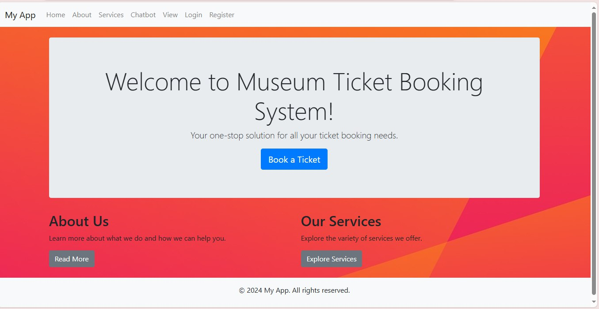

# Multilingual Chatbot Ticket Booking System 🎟️🤖



## Table of Contents
- [About the Project](#about-the-project)
- [Features](#features)
- [Installation](#installation)
- [Tech Stack](#tech-stack)
- [Usage](#usage)
- [Deployment](#deployment)
- [Screenshots](#screenshots)
- [Contributing](#contributing)
- [License](#license)
- [Contact](#contact)

---

## About the Project

This project is a **Multilingual Chatbot Ticket Booking System** that allows users to:
- Book tickets
- View museum items (3D models)
- Chat with a chatbot for assistance
- Choose the language they prefer for the web app interface

The chatbot is integrated with predefined responses and can assist users with booking tickets or answering common queries about services.

---

## Features
- **Multilingual support**: Users can select their preferred language.
- **Chatbot Integration**: A chatbot to assist users with ticket booking and FAQs.
- **Museum 3D Item Viewer**: A section where users can view 3D models of museum items.
- **User Authentication**: Users can log in and register to manage bookings.
- **Flask and PostgreSQL Integration**: Ticket bookings are stored and managed in a PostgreSQL database.
- **Responsive Design**: The web app is mobile-friendly and works across devices.

---

## Demo

You can view a live demo of the application [here](https://multilingual-chatbot-ticket-booking.onrender.com/).

## Installation

To get a local copy of the project up and running, follow these steps:

### Prerequisites

- Python 3.12 or higher
- PostgreSQL database

### Setup Instructions

1. **Clone the repository**

    ```bash
    git clone https://github.com/yourusername/multilingual-chatbot-ticket-booking-system.git
    ```

2. **Navigate to the project directory**

    ```bash
    cd multilingual-chatbot-ticket-booking-system
    ```

3. **Install the required Python packages**

    ```bash
    pip install -r requirements.txt
    ```

4. **Set up your PostgreSQL database**

    Set up your PostgreSQL database on Render or locally. Add your database URL in the `.env` file:

    ```bash
    DATABASE_URL=your_postgresql_url_here
    ```

5. **Run the Flask app**

    ```bash
    python app.py
    ```

6. **Open your browser**

    Go to [http://localhost:5000](http://localhost:5000).


### Tech Stack

- **Backend:** Flask (Python), Render (for PostgreSQL database hosting)
- **Frontend:** HTML, CSS, JavaScript
- **Database:** PostgreSQL
- **Chatbot:** Transformers (with predefined responses or AI-powered chatbot)
- **3D Models:** Integrated viewer for 3D museum items

### Usage

- **Homepage:** Users can browse and book tickets or view museum items.
- **Chatbot:** Available to assist users with booking and answering common queries.
- **User Authentication:** Users can log in or sign up to manage their bookings.

### Deployment

The app is deployed using Vercel for the frontend and Render for the PostgreSQL database.

### Steps to Deploy

1. Set up the environment variables on Vercel.
2. Connect your project’s GitHub repository to Vercel.
3. Configure Render for PostgreSQL and add the `DATABASE_URL` to Vercel's environment variables.

### Contributing

Contributions are welcome!
